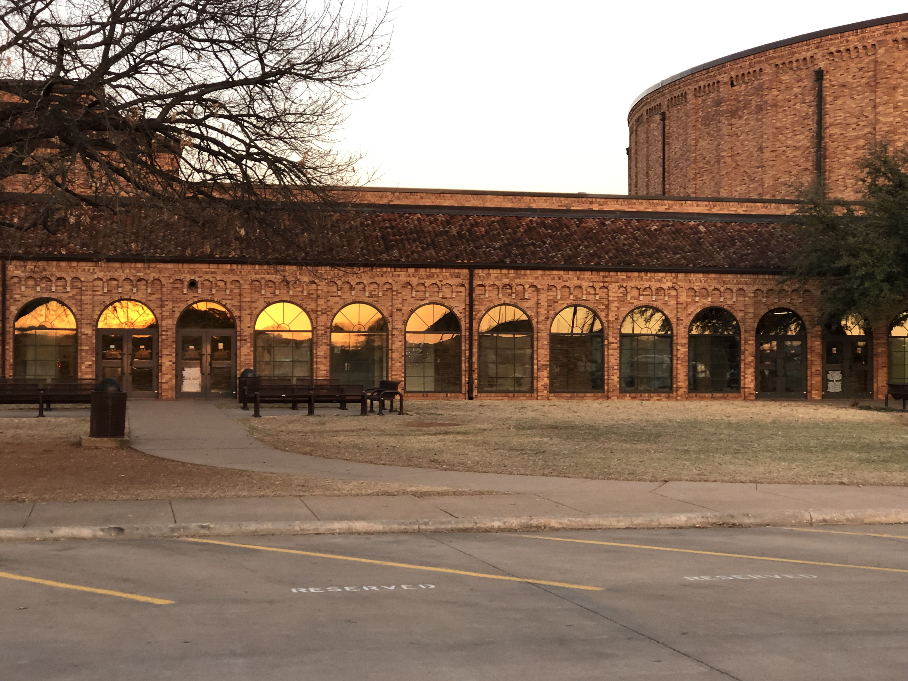
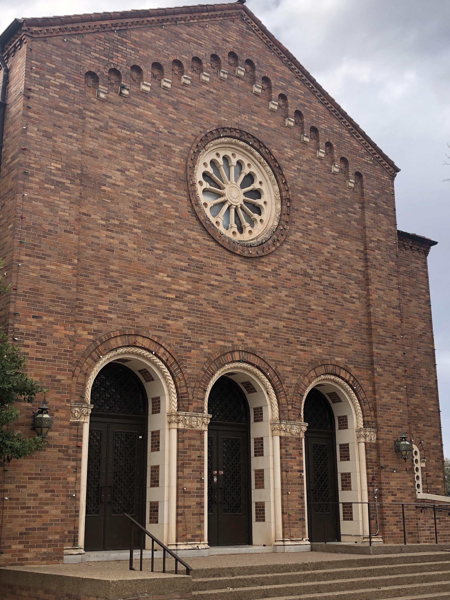
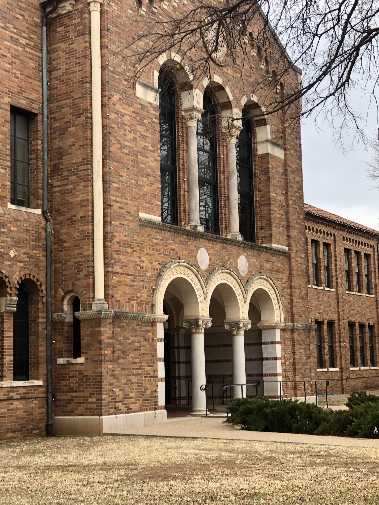
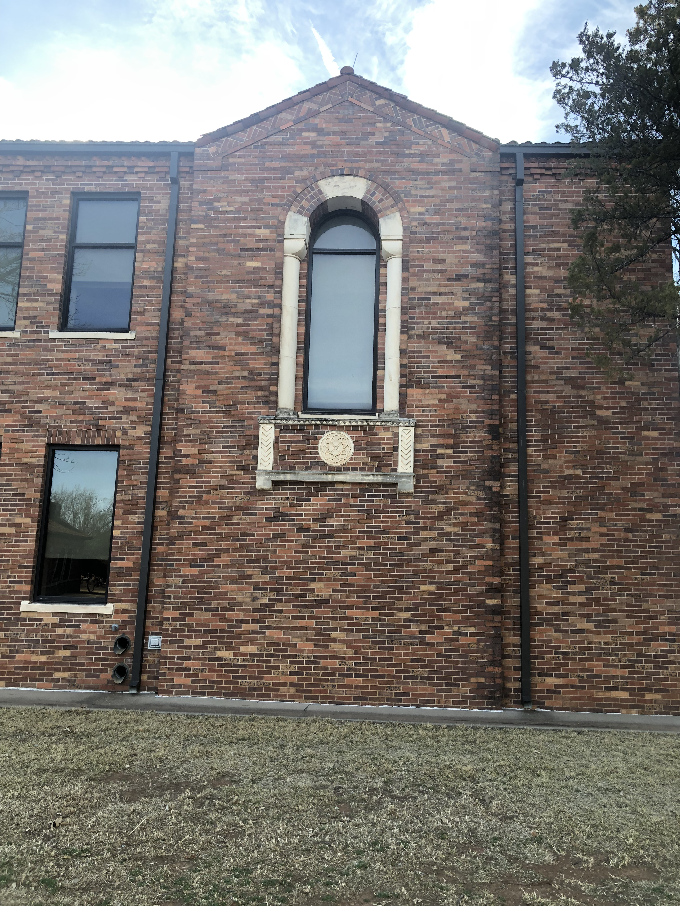

# msu-arches

>**GOAL: Find arches in the schools architecture, using simple CNN training and classification.**

## School Background

Created in 1922 as Wichita Falls Junior College, Midwestern State University built its first real building 
in 1937 on a 40-acre campus where it currently resides. The first building, which contained the entire college for a time was the Hardin Building, an impressive Spanish colonial structure which was presided over by a lofty bell tower. The architecture of course incorporates arches in every facet of the building. I am not an architect, but when you research "Spanish Colonial" the term arch is not prevelant. The key aspects are red tile (clay) roofs and stucco walls. The roofs exist on campus, but stucco is not. Further research shows there was a Spanish Colonial Revival Style (aka Spanish Eclectic style) that was prevalent from around 1915 - 1940. This style does include "rounded arches" but is not prevalent as it is on MSU's campus[^1]. Here is an image taken from [[1](http://www.phmc.state.pa.us/portal/communities/architecture/styles/spanish-colonial-revival.html)] showing a style which I find similar to what many of the buildings on campus portray. 

|                                                          Spanish Revival Post Office[^2]                                                          |
| :-----------------------------------------------------------------------------------------------------------------------------------------------: |
|  |

|                                             |                                             |                                             |
| :-----------------------------------------: | :-----------------------------------------: | :-----------------------------------------: |
|  |  |  |

|                                           |                                           |                                           |
| :---------------------------------------: | :---------------------------------------: | :---------------------------------------: |
|  |  |  |

The project of finding arches within architectural photos (pictures of buildings)sounds pretty easy. It might sound easy on the surface, until you look at all the components that should be created to accompany the image feature classification / object identification component. 

### Overview

- A full stack solution for finding arches in the Midwestern State University campus architecture using machine learning.
- This project should be a simple full stack implementation showing student the full gamut of what needs done (in some way shape or form) in a research project that requires data collection and some type of classification.

- The plan is to create a site that will allow image uploads of arch examples from msu campus. 
- Those photos need processed and saved in some location that will be conducive for processing, like a database.
- A CNN needs trained to guide the classification of extracted image arches so a more controlled series of images taken on campus can be processed and classified giving us a total count of all the arches included in the schools architecture.

### Components

- Login and registration
- Image upload site
- Image editing / component extraction (psuedo cropping / selection)
- CNN training
- Image classification (find arches from static images)
- Real time video classification (find arches while driving)

### School Background

Created in 1922 as Wichita Falls Junior College, Midwestern State University built its first real building 
in 1937 on a 40-acre campus where it currently resides. The first building, which contained the entire college for a time was the Hardin Building, an impressive Spanish colonial structure which was presided over by a lofty bell tower. The architecture of course incorporates arches in every facet of the building. I am not an architect, but when you research "Spanish Colonial" the term arch is not prevelant. The key aspects are red tile (clay) roofs and stucco walls. The roofs exist on campus, but stucco is not. Further research shows there was a Spanish Colonial Revival Style (aka Spanish Eclectic style) that was prevalent from around 1915 - 1940. This style does include "rounded arches" but is not prevalent as it is on MSU's campus[^1]. Here is an image taken from [[1](http://www.phmc.state.pa.us/portal/communities/architecture/styles/spanish-colonial-revival.html)] showing a style which I find similar to what many of the buildings on campus portray. 

|                                                                      Example                                                                      |
| :-----------------------------------------------------------------------------------------------------------------------------------------------: |
|  |

</a>

# #References: 

[^1]: [Spanish Colonial Revival](http://www.phmc.state.pa.us/portal/communities/architecture/styles/spanish-colonial-revival.html)
[^2]: [Spanish Revival Post Office](http://www.phmc.state.pa.us/portal/communities/architecture/images/spanishcolrevival_postofficeatsayre_bradford_800px.jpg)
